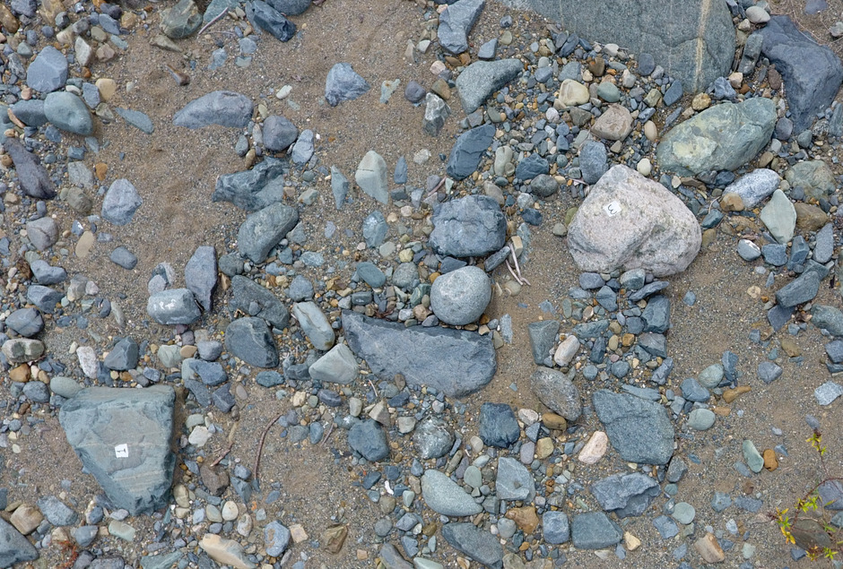

# Estimación de la granulometría de carga gruesa superficial mediante fotogrametría de alta resolución UAV

*XVIII Jornada de Investigación Científica, UASD*

*12, 13 y 14 de noviembre, 2019*

*Santo Domingo, República Dominicana*

**Sometimiento de resumen**

| | |
|:--|:-----------|
| **Título:** | Estimación de la granulometría de carga gruesa superficial mediante fotografías de alta resolución tomadas por UAV |
| **Tipo de participación:** | Oral |
| **Nombre de autores:** | José Ramón Martínez Batlle |
| **Institución/Facultad:** | Facultad de Ciencias |
| **Resumen:** | La granulometría de carga gruesa de un río aluvial se considera un registro inestimable del mismo, que funciona a modo de "libro de procesos históricos". El estudio de la granulometría se utiliza para reconstruir procesos de la cuenca de drenaje, como por ejemplo los flujos de escombros (debris flow), normalmente asociados con riadas peligrosas y que han afectado grandes poblaciones en distintos países. En este estudio se presentan los resultados de la estimación de la granulometría de la carga gruesa de una parcela ~5x5m en la llanura aluvial del río Mana, proximidades de Villa Altagracia. Se tomaron fotografías volando un dron a baja altura, con una resolución espacial de terreno (GSD) de 2 mm. Previo al vuelo se etiquetaron clastos de distintos tamaños y tipologías litológicas con identificadores únicos, y se midieron con calibradores (pie de rey). Posteriormente, utilizando OpenDroneMap, se generó una ortofotografía de la parcela, la cual fue segmentada utilizando ImageJ para individualizar todos los clastos. El resultado fue vectorizado y, posteriormente, se calcularon los ejes mayor y menor de la envolvente convexa de cada clasto. Los cálculos semi-automatizados se compararon con las mediciones realizadas en terreno; no se encontraron diferencias signitificativas entre ambas mediciones. La metodología propuesta tiene potenciales aplicaciones para conocer la granulometría superficial de carga gruesa en superficies extensas, como por ejemplo la llanura de inundación del río. |
| **Palabras clave:** | clastos, dron, río aluvial, OpenDroneMap, ImageJ |

