```{r setup, include=FALSE}
knitr::opts_chunk$set(echo = FALSE)
```

## Producción del último año
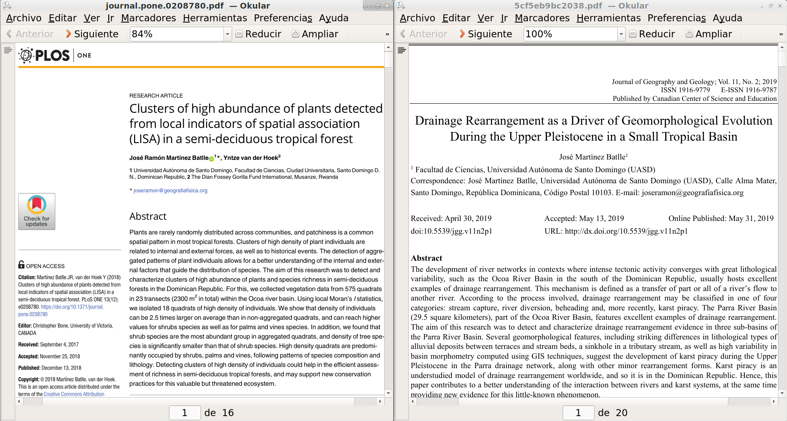

|   |   |
|---|---|
|<span style="font-size:60%;">[Clusters of high abundance of plants detected from local indicators of spatial association (LISA) in a semi-deciduous tropical forest](https://journals.plos.org/plosone/article?id=10.1371/journal.pone.0208780)</span> |<span style="font-size:60%;">[Drainage Rearrangement as a Driver of Geomorphological Evolution During the Upper Pleistocene in a Small Tropical Basin](http://www.ccsenet.org/journal/index.php/jgg/article/view/0/39703)|</span>|


# Introducción

## Carga gruesa

* La carga gruesa son materiales de dimensiones __más grandes que la del grano de arena__, transportados por cursos fluviales __mediante reptación, arrastre o saltación__.

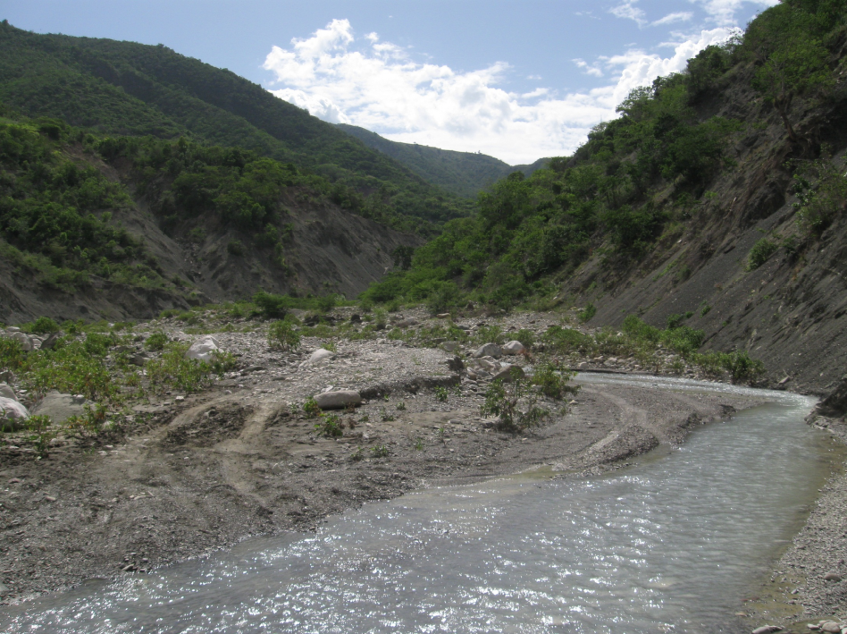

## 

* Esta carga suele depositarse en el __lecho del río__, pero también ocupa __bancos laterales y bancos medianos__ en cursos de montaña y/o estacionales.

* La carga gruesa es una __huella dactilar del río__, revela su régimen de crecidas/inundaciones, así como las características geológicas y geomorfológicas de su cuenca.

## 
Según @bunte2001sampling

## 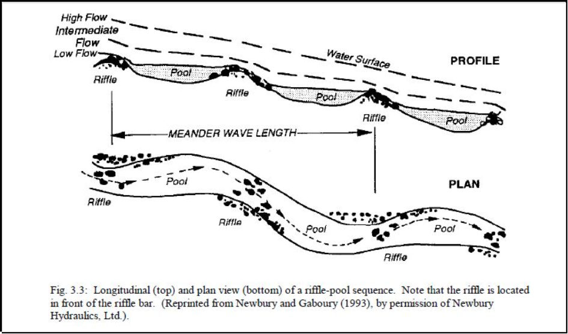
Según @bunte2001sampling

## 

## 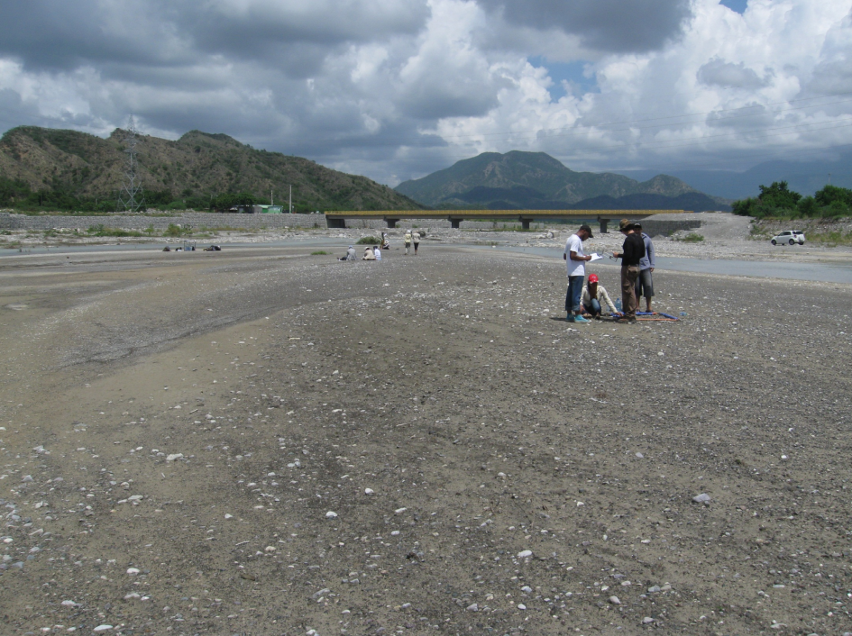

## 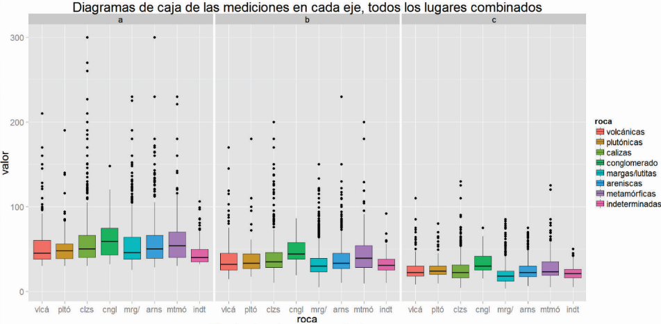

## 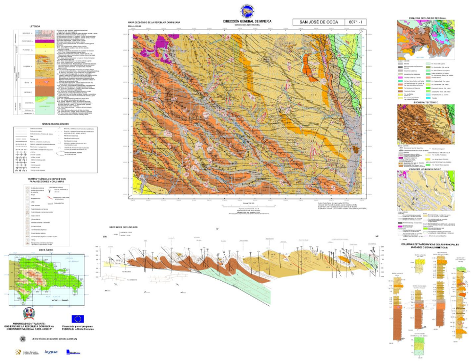

## Objetivo

* Evaluar la __precisión de mediciones__ de clastos realizadas en __terreno__ (*ground truth*) contra mediciones realizadas con __técnicas fotogramétricas__ (semiautomáticas).

# Metodología

## Materiales

* Drone + cámara.

* Cinta de medir.

* Dispositivo Android.

* QGIS + OpenDroneMap + ImageJ + GDAL + ODK + R


## Flujo de trabajo


## 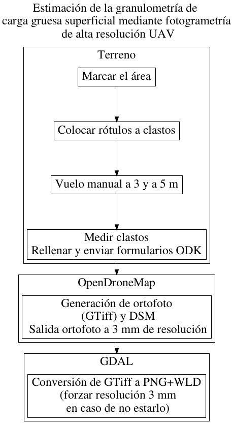

## 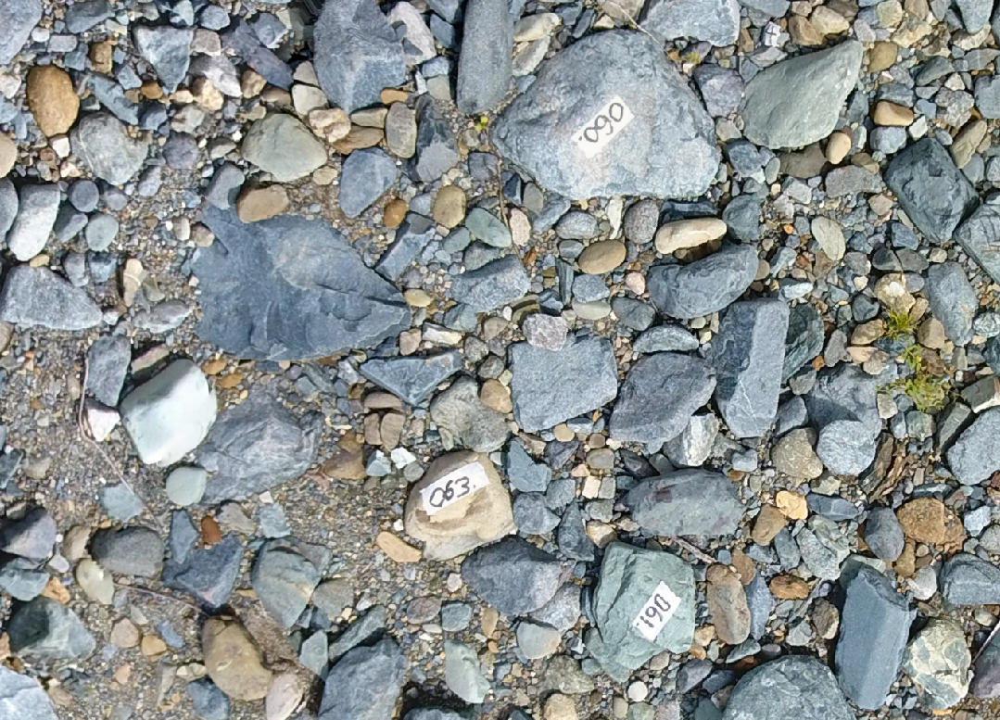

## 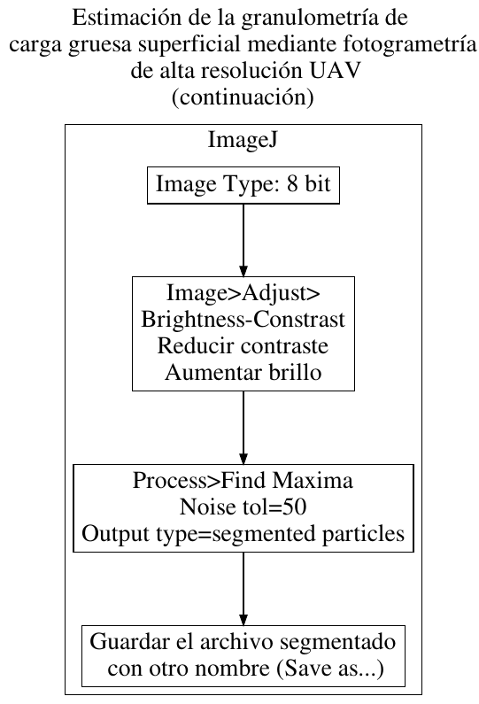

## 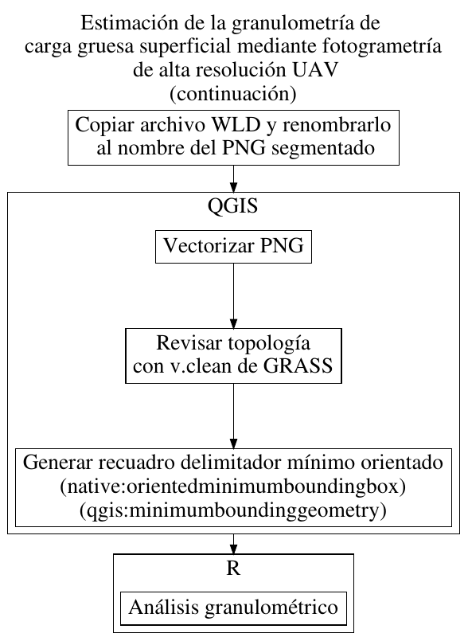


# Resultados

## 

* __Dos visitas__ entre julio y septiembre de 2019, para cubrir un área de __~10x15 m en un banco lateral del río Mana__, proximidades de La Represa-El Cidral, Villa Altagracia.

* En la __primera visita__, a modo de prueba, se utilizó un __plan vuelo a 10 m__ de altura para el drone. Se procesaron las imágenes y se determinó la altura de vuelo/GSD idónea, así como el tamaño de las etiquetas a colocar a los clastos. En esta visita también se midieron 100 clastos con cinta métrica para aplicar *ground truth*, las cuales mostraron correlación (de forma combinada) con las mediciones tomadas de la ortofoto.

* En la __segunda visita__ se realizaron __dos vuelos manuales__ sobre las 10 am, uno a 3 m (vuelo bajo) y otro a 5 m (vuelo medio).

##

* En el __vuelo bajo se colectaron ~200 imágenes__ (GSD 0.8 mm), se realizó restitución y se generaron DSM, ortofoto (1 mm de resolución, y remuestre posterior a 3 mm) y otros productos.

* En el __vuelo medio se tomaron ~100 imágenes__, las cuales se restituyeron pero simplemente se reservaron, dado que las del vuelo bajo eran idóneas para el objetivo propuesto.

* Para *ground truth*, en esta visita se midieron __76 clastos__ con cinta métrica.

## 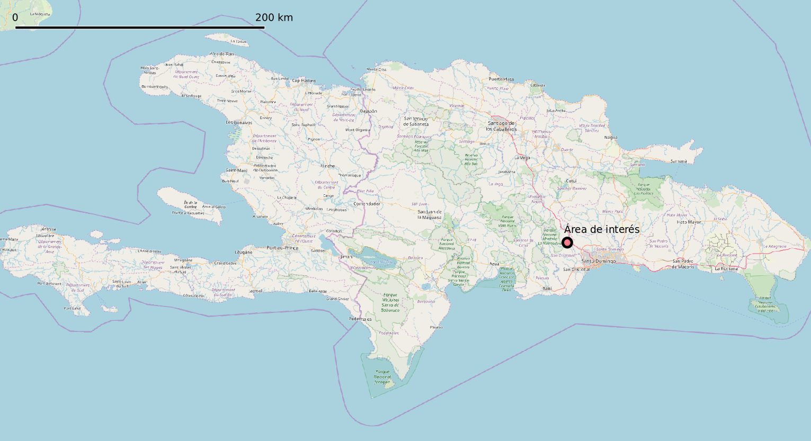

## 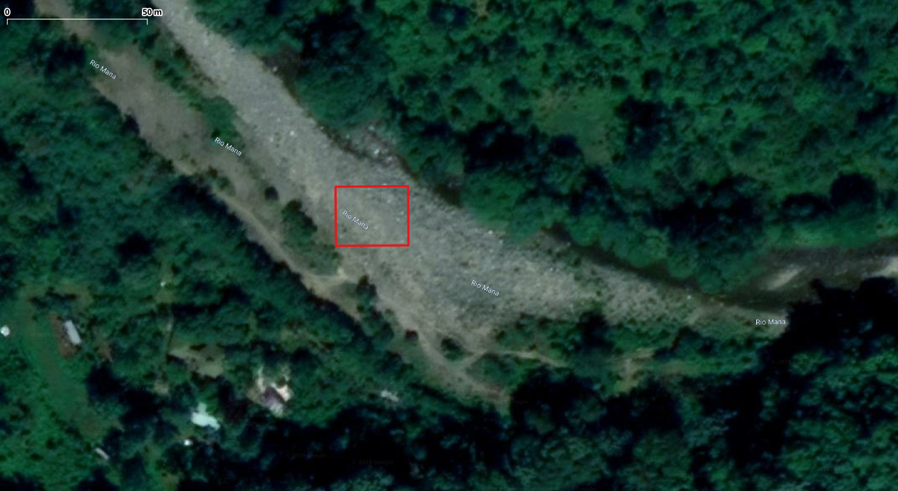

## 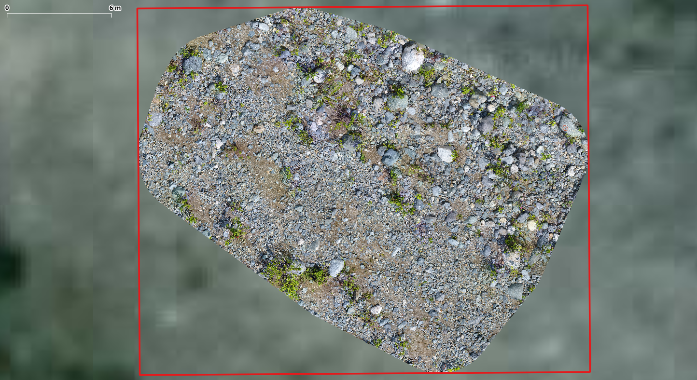

## 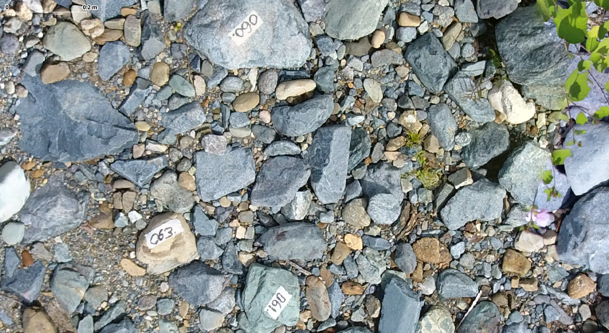


```{sql, eval=F, echo=F}
#En servidor ODKAggregate
COPY (
  SELECT * FROM "CANTOMETRIA3_CORE" core INNER JOIN "CANTOMETRIA3_CLASTOS" clastos on clastos."_PARENT_AURI"=core."_URI")
  TO '/tmp/cantometria.csv' DELIMITER ',' NULL AS 'NULL' csv header;
```

## 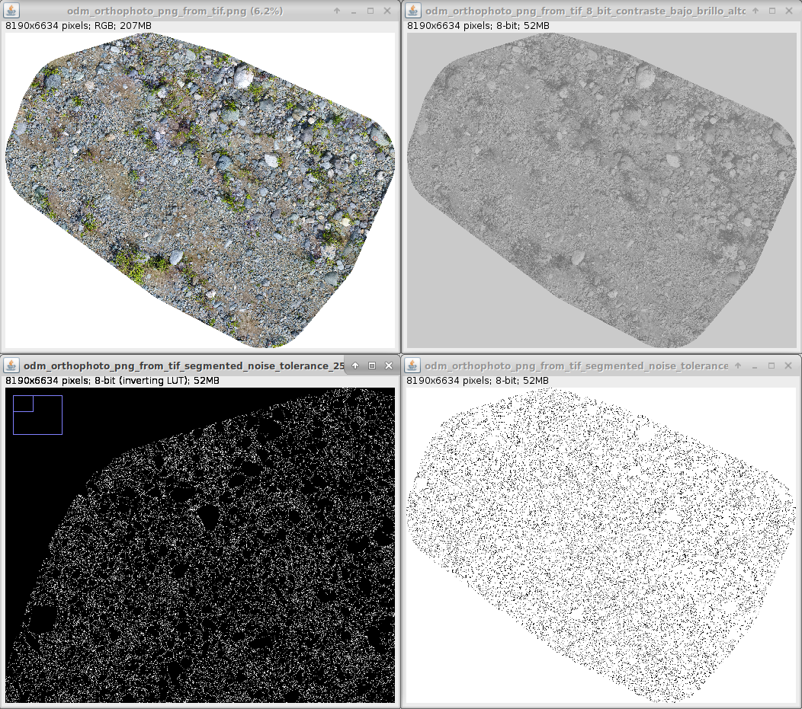

## 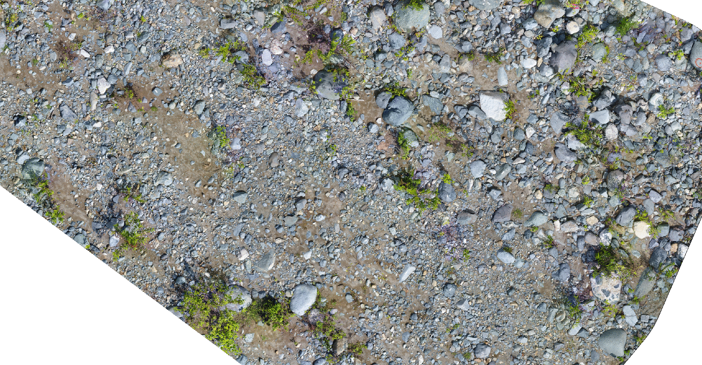

## *Ground truth*

```{r, echo=F, warning=F, message=F}
library(tidyverse)
gt <- read_csv('data/cantometria.csv')
gt2 <- gt %>%
  select(idmuestra=`_URI`,
         idelemento=MEDICIONES_CODIGOCLASTO, a_groundt=MEDICIONES_A, b_groundt=MEDICIONES_B) %>%
  filter(idmuestra=='uuid:6cdd28b7-f9f3-4fbb-90db-52dc34fcfebd')
gt2 %>% gather(variable, valor, a_groundt:b_groundt) %>% ggplot() +
  aes(x=valor, fill=variable) + geom_density(alpha=0.4) +
  scale_x_continuous(trans = 'log10') + facet_wrap(variable~.)
```

## *Ground truth*

```{r}
gt2 %>% gather(variable, valor, a_groundt:b_groundt) %>% ggplot() +
  aes(x=variable, y=valor, fill=variable) +
  geom_boxplot(alpha=0.4) + scale_y_continuous(trans = 'log10')
```

## *Ground truth*

```{r, echo=F, warning=F, message=F}
statgt2 <- gt2 %>% dplyr::select(a_groundt,b_groundt) %>%
  summarise_each(funs(mean, median, sd), a_groundt:b_groundt) %>%
  gather() %>% mutate(value=round(value,2))
statgt2 %>% kableExtra::kable()
```

## Mediciones semiautomáticas

```{r, echo=F, warning=F, message=F}
library(sf)
auto <- st_read(dsn = 'data/odm_orthophoto_png_from_tif_segmented_noise_tolerance_25_particles_500_infinity_gtiff_rectangulos_02.gpkg', quiet = T)
cat('Número de rectángulos delimitadores:', nrow(auto))
auto2 <- auto %>% dplyr::select(idelemento=label, a_auto=height, b_auto=width) %>% 
  mutate(a_auto=a_auto*1000, b_auto=b_auto*1000)
autogt <- auto2 %>% inner_join(gt2)
statauto2 <- autogt %>% dplyr::select(a_auto,b_auto) %>% st_drop_geometry() %>% 
  summarise_each(funs(mean, median, sd), a_auto:b_auto) %>%
  gather() %>% mutate(value=round(value,2))
statauto2 %>% kableExtra::kable()
```

## Mediciones semiautomáticas

```{r, echo=F, warning=F, message=F}
autogt %>% gather(variable, valor, a_auto:b_auto) %>% ggplot() +
  aes(x=valor, fill=variable) + geom_density(alpha=0.4) +
  scale_x_continuous(trans = 'log10') + facet_wrap(variable~.)
```

## Mediciones semiautomáticas

```{r}
autogt %>% gather(variable, valor, a_auto:b_auto) %>% ggplot() +
  aes(x=variable, y=valor, fill=variable) +
  geom_boxplot(alpha=0.4) + scale_y_continuous(trans = 'log10')
```

## Estadísticos comparados, correlación y diferencias entre *ground truth* y metodología semiautomática

## Estadísticos comparados

```{r, echo=F, warning=F, message=F}
cbind(statgt2, statauto2) %>% kableExtra::kable()
```


## Correlación

```{r, echo=F, warning=F, message=F}
library(ez)
autogt %>%
  dplyr::select(matches('^a')) %>%
  st_drop_geometry() %>% ezCor()
```

##

```{r, echo=F, warning=F, message=F}
autogt %>%
  dplyr::select(matches('^b')) %>%
  st_drop_geometry() %>% ezCor()

```

## 

```{r, echo=F, warning=F, message=F}
t.test(autogt$a_auto, autogt$a_groundt)
t.test(autogt$b_auto, autogt$b_groundt)
```

## 

```{r, echo=F, warning=F, message=F}
t.test(autogt$a_auto, autogt$a_groundt, paired = T)
t.test(autogt$b_auto, autogt$b_groundt, paired = T)
```

## Fallos:

* Falsos negativos: clastos codificados como "017", "050" y "074".

* El eje b no siempre se logra capturar adecuadamente.

* Una cantidad aun no cuantificada de __falsos positivos__


# Discusión y perspectivas

## Discusión

* Los falsos positivos, los falsos negativos y las imprecisiones en el eje b, pueden mejorarse sobrevolando en horarios de mediodía.

* Igualmente, se lograrían mejores rectángulos delimitadores, utilizando segmentando con técnicas de *machine learning*.

* Una __desventaja remarcable es la capacidad de cómputo requerida__ para la restitución fotogramétrica. Esta limitante puede solventarse adquiriendo servicios en la nube, una alternativa sólo viable si la demanda es esporádica. En caso de demanda recurrente, es preferible disponer de estación de trabajo con suficientes recursos de memoria.

## 

* La __metodología demuestra ser viable__ para superficies con exposición directa al sol.

* __Bajo dosel__, o con plantas arbustivas, la segmentación generaría __resultados inapropiados__ o difícilmente aprovechables.

* La metodología propuesta, por su bajo coste, es una __alternativa idónea para evaluar la granulometría de carga gruesa superficial__, pudiendo ser útil para la detección de los peligrosos depósitos de __*debris flows*__.


## Perspectivas

* Aplicar la metodología a __superficies menos desafiantes__ (sin arbustos, con mejor iluminación), pero más grandes.

* Introducir algoritmos de __*machine learning*__ en la segmentación (e.g. Weka).

* Añadir la __capa de DSM__ para afinar mejor la segmentación de clastos.

* Analizar __forma del clasto__, ángulos de los ejes y evaluar tipología litológica.

* Combinar con __geomórfonos__.

## 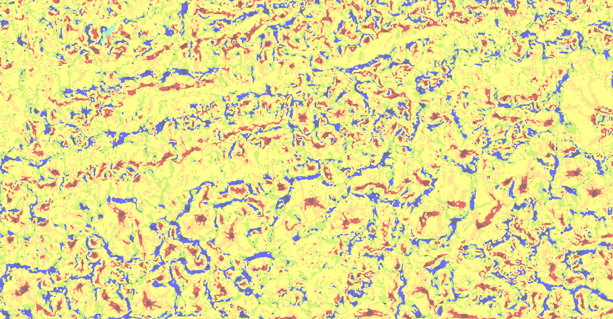


# Referencias

##

