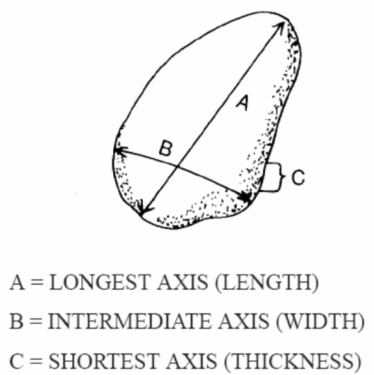

```{r setup, include=FALSE}
knitr::opts_chunk$set(echo = FALSE)
```

## Producción del último año


|   |   |
|---|---|
|<span style="font-size:60%;">[Clusters of high abundance of plants detected from local indicators of spatial association (LISA) in a semi-deciduous tropical forest](https://journals.plos.org/plosone/article?id=10.1371/journal.pone.0208780)</span> |<span style="font-size:60%;">[Drainage Rearrangement as a Driver of Geomorphological Evolution During the Upper Pleistocene in a Small Tropical Basin](http://www.ccsenet.org/journal/index.php/jgg/article/view/0/39703)|</span>|


# Introducción

## 
Según @bunte2001sampling

## 
Según @bunte2001sampling

## 

## 

## 

## 

## 

# Metodología

## Materiales

* Drone + cámara.

* Cinta de medir.

* Dispositivo Android.

* QGIS + OpenDroneMap + ImageJ + GDAL + ODK + R


## Flujo de trabajo


## 

## 

## 

## 


# Resultados

## 

* Dos visitas entre julio y septiembre de 2019, para cubrir un área de ~10x15 m en un banco lateral del río Mana, proximidades de La Represa, Villa Altagracia.

* En la primera visita, a modo de prueba, se voló con plan vuelo a 10 m de altura. Se procesaron los cuadros y se determinó altura de vuelo/GSD idónea, tamaño de etiquetas y número de clastos para *ground truth*

* En la segunda visita se realizaron dos vuelos manuales, uno a 3 m (vuelo bajo) y otro a 5 m (vuelo medio).

##

* En el vuelo bajo se colectaron ~200 cuadros a 3 m, GSD 0.8 mm, se realizó restitución y se generaron DSM, ortofoto (1 mm de resolución, y remuestre posterior a 3 mm) y otros productos.

* ~100 fotos a 5 m, las cuales se restituyeron pero sólo se reservaron, dado que las del vuelo bajo eran idóneas para el objetivo propuesto.

* Para *ground truth*, se midieron 100 clastos en la primera visita y 76 clastos en la segunda

## 

## 

## 


```{sql, eval=F, echo=F}
COPY (
  SELECT * FROM "CANTOMETRIA3_CORE" core INNER JOIN "CANTOMETRIA3_CLASTOS" clastos on clastos."_PARENT_AURI"=core."_URI")
  TO '/tmp/cantometria.csv' DELIMITER ',' NULL AS 'NULL' csv header;
```

## Ground-truth

```{r, echo=F, warning=F, message=F}
library(tidyverse)
d <- read_csv('data/cantometria.csv')
d %>%
  select(idmuestra=`_URI`, idelemento=MEDICIONES_CODIGOCLASTO, a=MEDICIONES_A, b=MEDICIONES_B) %>% 
  filter(idmuestra=='uuid:6cdd28b7-f9f3-4fbb-90db-52dc34fcfebd') %>% 
  gather(variable, valor, a:b) %>% 
  ggplot() + aes(x=valor) + geom_histogram(bins=10) + scale_x_continuous(trans = 'log10') + facet_wrap(variable~.)
```


# Discusión y perspectivas

## Discusión

* La __metodología demuestra ser viable__ para superficies con exposición directa al sol; bajo dosel, o con plantas arbustivas, la segmentación sería difícilmente practicable.

* Las clases de __clastos mayores__ (guijarros y bloques, >64 mm) dieron las __mejores correspondencias__ entre ground-truth y medición informática.

* En las __gravas se registran los mayores errores__ de medición informatizada, al ser difícil segmentarlas por su menor tamaño y por su habitual solapamiento con otros elementos.

## 

* La metodología propuesta, por su bajo coste, es una __alternativa idónea para evaluar la granulometría de carga gruesa superficial__, pudiendo ser útil para la detección de los peligrosos depósitos de __*debris flows*__.

* Una __desvantaja remarcable es la capacidad de cómputo requerida__ para la restitución fotogramétrica. Esta limitante puede solventarse adquiriendo servicios en la nube, una alternativa sólo viable si la demanda es esporádica.

## Perspectivas

* Aplicar la metodología a __superficies menos desafiantes__ y más grandes.

* Introducir algoritmos de __*machine learning*__ en la segmentación (e.g. Weka).

* Añadir la __capa de DSM__ para afinar mejor la segmentación de clastos.

* Combinar con __geomórfonos__.

## 


# Referencias

##

